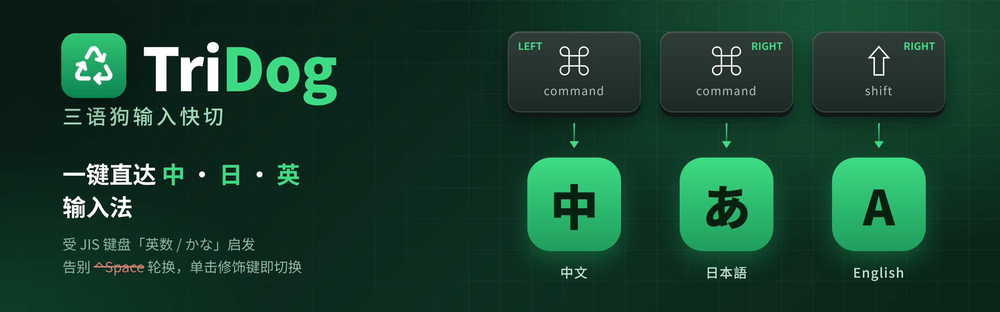
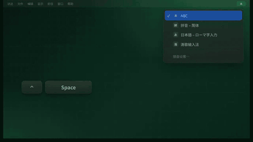

# TriDog (三语狗输入快切)

[中文](README.md) | **English** | [日本語](README.ja.md)





A tiny macOS menu bar app: **tap a modifier key to jump straight to a specific input method**. Made for people who type in Chinese, Japanese and English and are tired of cycling with ⌃Space.

> **Scope: this project is for US-layout keyboards only.** JIS (Japanese) keyboards already have dedicated 英数 / かな keys that switch input methods natively, so they don't need it.

| Tap | Switches to |
|---|---|
| Left ⌘ | A Chinese input method, **your choice from the menu** (default: Qingg / 清歌输入法, or the first available one if Qingg isn't installed) |
| Right ⌘ | Japanese (Romaji) |
| Right ⇧ or Left ⇧ | English (ABC). **Choose Left ⇧ or Right ⇧ in the menu** (default: Right ⇧) |

Only a clean tap counts: press and release with nothing in between. ⌘C, ⌘-click and typing capitals with Shift never trigger a switch.

## Install

1. Download the latest `TriDog-x.x.x.zip` from [Releases](https://github.com/aoyamashou/TriDog/releases), unzip it, and move `TriDog.app` to Applications.
2. This is a hobby project and is not notarized by Apple, so macOS may block it on first launch. Right-click it and choose **Open**.
3. Allow TriDog under **System Settings → Privacy & Security → Input Monitoring**.

Requires an Apple Silicon Mac running macOS 13 or later.

## Menu

Click the ♻ icon in the menu bar:

- **Refocus after switching** (off by default): a long-standing macOS bug sometimes leaves the focused app on the old input method after switching to a Chinese, Japanese or Korean input method, even though the menu bar has already changed. With this on, TriDog briefly takes focus for about 30 ms and hands it back, which forces the app to pick up the new input method. The trade-off is a short focus flicker, and an open menu or popover may close.
- **Left ⌘ switches to**: choose from your enabled input methods. English keyboard layouts like ABC and Apple's Japanese input method are not listed.
- **Key for English (ABC)**: Left ⇧ or Right ⇧.
- **About / Quit**

Menu labels follow your system language (Chinese, Japanese, or English).

## Different key preferences?

If this layout doesn't suit you (other keys, other input methods), clone this repo and have your AI agent (e.g. Claude Code) change it. All the logic lives in one file, `Sources/main.swift`:

```bash
git clone https://github.com/aoyamashou/TriDog.git
```

## Build from source

Only the Xcode Command Line Tools are needed, not the full Xcode:

```bash
./build.sh
open build/TriDog.app
```

The Japanese and ABC input source IDs are defined at the top of `Sources/main.swift`. The icon is generated by `Scripts/make-icon.swift`.

## Credits & License

Based on [⌘英かな (cmd-eikana)](https://github.com/iMasanari/cmd-eikana) by iMasanari, via [dominion525's Apple Silicon fork](https://github.com/dominion525/cmd-eikana). Released under the [MIT License](LICENSE), the same as upstream.
